## License

This library is licensed under the Amazon Software License.

# Finding Missing Persons by Scanning Social Media with Amazon Rekognition - AWS Workshop #

In this workshop, we will build a solution that automatically launches
and configures [Amazon
Rekognition](https://aws.amazon.com/rekognition/), [[Amazon Kinesis
Firehose]{.underline}](https://aws.amazon.com/kinesis/firehose/),
[Amazon Simple Storage
Service(S3)](https://aws.amazon.com/s3/?nc2=h_l3_sc), [AWS
Lambda](https://aws.amazon.com/lambda/?nc2=h_l3_c), [Amazon
DynamoDB](https://aws.amazon.com/dynamodb/?nc2=h_l3_db), [Amazon Simple
Notification Service (SNS)](https://aws.amazon.com/sns/), & [Amazon
Elastic Cloud Compute (EC2)](https://aws.amazon.com/ec2/) to collect,
store, process, and analyze data to search for missing persons on social
media data streams. The diagram below presents the Find Missing Persons
by Scanning Social Media with Amazon Rekognition architecture you can
deploy in minutes using this guide and accompanying [AWS
CloudFormation](https://aws.amazon.com/cloudformation/?nc2=h_l3_dm)
template.

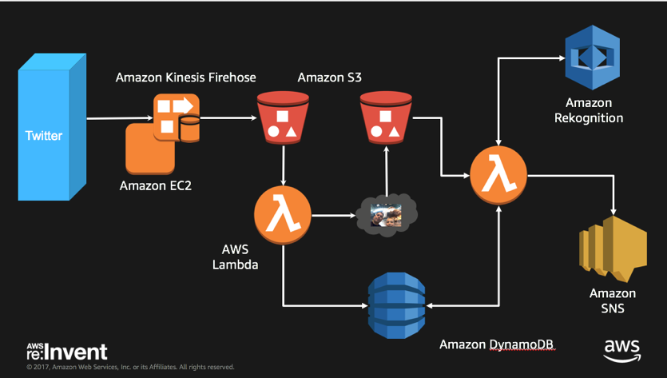

1.  This solution uses python code on an EC2 instance to listen to Twitter feed to capture images from that feed.

2.  The EC2 instance pushes Twitter meta data in JSON format to an S3 bucket via Amazon Kinesis Firehose. 

3.  A Lambda function is invoked based on the S3 PUT operation to the initial S3 bucket that will read the JSON meta data. It writes relevant information to DynamoDB, and will copy the image into a second S3 bucket.

4.  A second Lambda function is invoked, based on the S3 PUT operation to analyze the photo and look for a match of the missing person. Results will be stored in DynamoDB, and a successful match will send an email alert via SNS.

**What you will accomplish:**

**Deploy Find Missing Persons by Scanning Social Media with Amazon Rekognition** using [AWS CloudFormation](https://aws.amazon.com/cloudformation/). The
CloudFormation template will automatically launch and configure the components necessary to consume and analyze streaming data.

**Automatically analyze streaming data** in an Amazon Kinesis
Analytics application. You can customize the Amazon Kinesis Analytics application that is included with the solution.

**What you will need before starting:**

1.  **An AWS account: **You will need an AWS account to begin
    provisioning resources. [Sign up for
    AWS](https://portal.aws.amazon.com/gp/aws/developer/registration/index.html).

2.  **Twitter Developer account and create a Twitter application with keys and tokens** <https://apps.twitter.com>

3.  **Reference Missing Person Image:** You will need a reference image for the simulated missing person for Rekognition to compare against.This should be in jpg format.

4.  **Twitter account and Twitter app running on your phone (or
    laptop)**

**Skill level:** This solution is intended for IT infrastructure
 professionals who have practical experience with streaming data and architecting on the AWS Cloud.

**Rekognition Lab**

The procedure for deploying this architecture on AWS consists of the following steps. For detailed instructions, follow the links for each step.

Step 1. Pre-Workshop Setup Steps
=================================

1.  Set up your Twitter Application (Required step)

    a.  Go to <https://apps.twitter.com>

     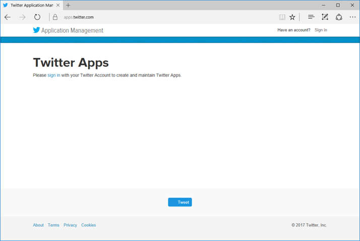

    b.  Login if you have an account, otherwise sign up for a new
      account. Note you will need your mobile number included in your account profile to build Twitter apps.

     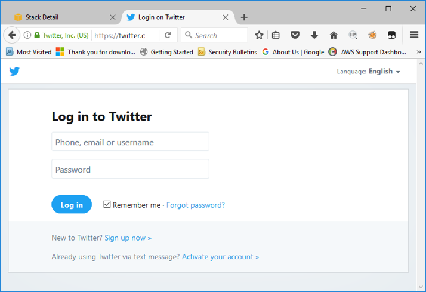

    c. Select Create New App

     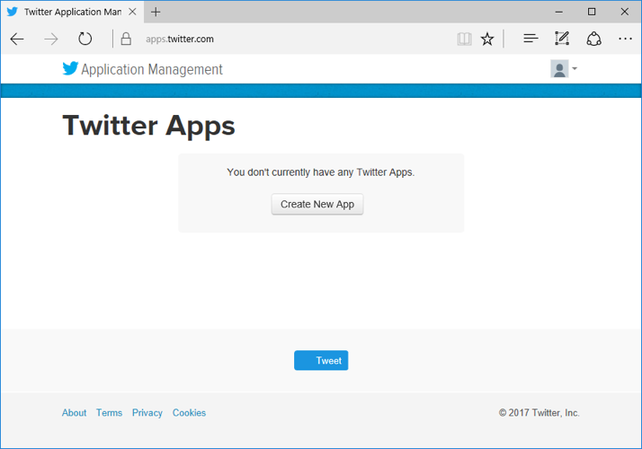

    d. Provide a unique name such as FindMissingPersonsRekognitions & add your initials etc

     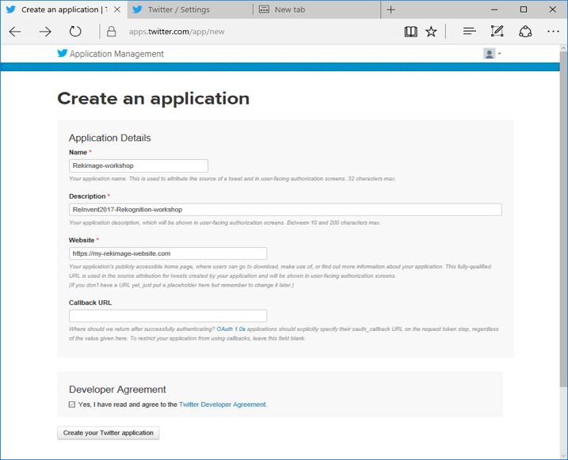

    e.  Next you will get the details from your new app. Key data points to collect are consumer key/api highlighted by the red arrow below.

     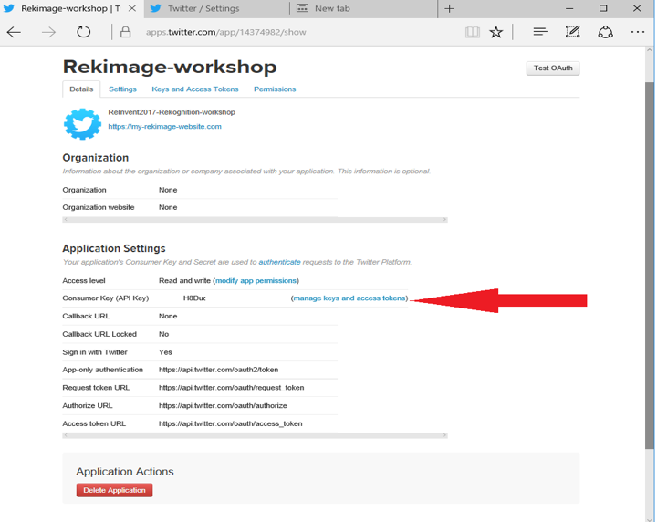

    f. Click on the Key & Access tokens

     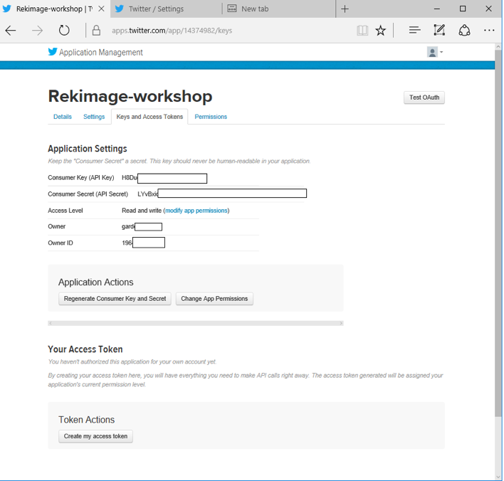

    g. To generate tokens -- click on the create my access token then capture the details such as shown in the screen below

     

    h. Capture your API Key & Secret and Access Token and Secret for later use in Notepad or text editor

2.  Create a new EC2 Key Pair - For this workshop, you will need to create an EC2 instance using an SSH keypair in the Ireland region (eu-west-1). ***[If you already have a SSH key pair in Ireland region please skip this section and go onto the
next.]{.underline}*** The following steps outline creating a unique SSH keypair for you to use in this workshop.

    a.  Sign into the AWS Management Console and open the Amazon EC2 console at <https://console.aws.amazon.com/ec2>

    b.  In the upper-right corner of the AWS Management Console, confirm you are in the Ireland region.

    c.  Click or type EC2 on search line then click on EC2 service from the menu

    d.  Click on Key Pairs in the NETWORK & SECURITY section near the bottom of the leftmost menu. This will display a page to manage your SSH key pairs.

   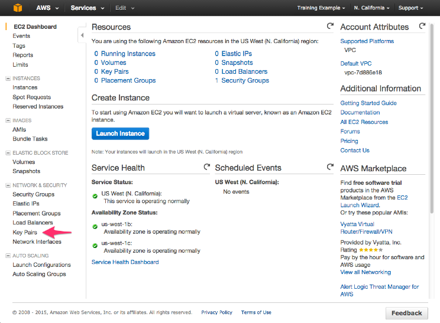

    e.  To create a new SSH key pair, click the Create Key Pair button at the top of the browser window

    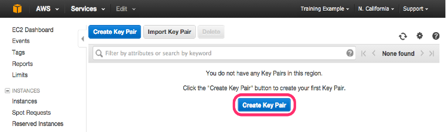

    f.  In the resulting pop up window, type \[First Name\]-\[LastName\]-Rekognition into the Key Pair Name: text box and click Create.

    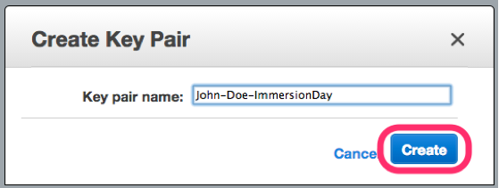

    g.  The page will download the file "\[Your-Name\]-Rekognition.pem" to the local drive. Follow the browser instructions to save the file to the default download location.

    h.  Remember the full path to the file .pem file you just downloaded. You will use the Key Pair you just created to manage your EC2 instances for the rest of the lab

Step 2. Launch the Stack
========================

This automated AWS CloudFormation template deploys Find Missing Persons by Scanning Social Media with Amazon Rekognition on the AWS Cloud.

**You are responsible for the cost of the AWS services used while
running this solution. We are providing \$25 AWS credit which should
more than cover those cost during the workshop.**

1. Log in to the **AWS Management Console** and ensure you select the **Ireland** AWS region in the top right region selection.

2. Under **Specify an Amazon S3 template URL**, enter the following and select **Next**

 [**https://s3-eu-west-1.amazonaws.com/awsreinvent2017workshop/RekognitionWorkshopCFN.json**](https://s3-eu-west-1.amazonaws.com/awsreinvent2017workshop/RekognitionWorkshopCFN.json)

 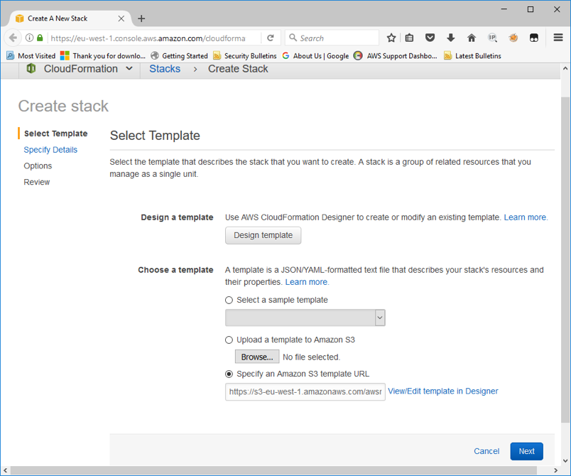

3. On the **Specify Details** page, assign a name to your Find Missing Persons by Scanning Social Media with Amazon Rekognition solution stack. This stack name should be all lower case characters & numbers and be short since we use it for bucket names etc.

| **Parameter** | **Default** | **Description** |
| --------------| :----------: | :-------------- |
|**StackName**  |  twtrrekog | Name of the Stack to launch **Must all be lowercase letters.**|
| EmailAddress | *Requires input* | Email address to use during workshop so you can receive emails notifications.|
| InstanceType | *t2.Micro* | Select your instance type. Recommend t2.Micro |
| KeyName | *Requires input* | SSH key for Ireland region to use during the workshop. Without this key you will not be able to connect to your instance.|
|MissingPersonPhotoFilename | *missingperson.jpg* | Name of missing person reference photo to be stored in S3 bucket.|
| SSHLocation | *0.0.0.0/0* | The IP address range that can be used to SSH to the EC2 instances |
| TwitterConsumerKey | *Requires input* | Twitter Consumer Key, as generated by dev.twitter.com. Part of the pre setup steps |
| TwitterConsumerSecret | *Requires input* |Twitter Consumer Secret, as generated by dev.twitter.com Part of the pre setup steps|
| **TwitterToken** | *Requires input* | Twitter Access Token, as generated by dev.twitter.com. Part of the pre setup steps |
| TwitterTokenSecret | *Requires input* | Twitter Access Token Secret, as generated by dev.twitter.com Part of the pre setup steps |

Under **Parameters**, review the parameters for the template, and modify them as necessary. This solution uses the following default values.

It should look something like the picture below

  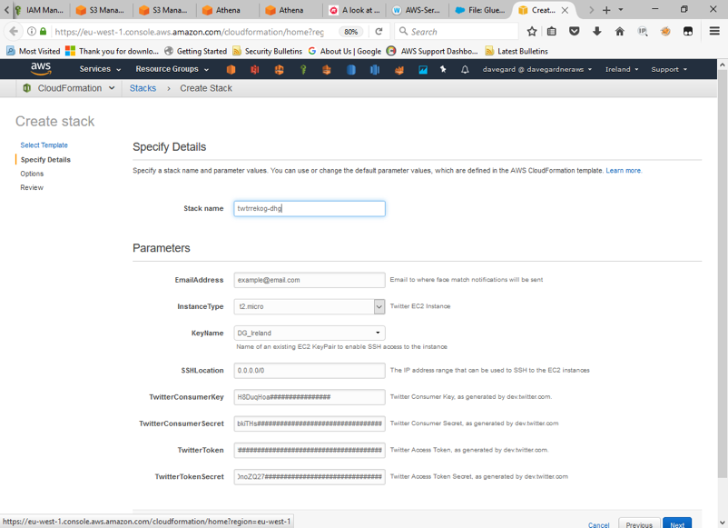

5. Verify that you modified the correct parameters for your chosen destination.

6.  Choose **Next**.

7.  On the **Options** page, update tag values. Set Key to "Name" and any Value such a "FindMissingPersonsReInventRekognition".

8.  Use the default Permissions and Advanced settings.

9.  Choose **Next**.

 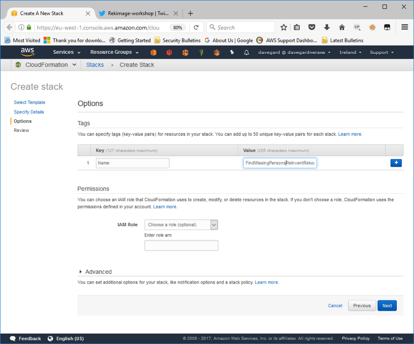

10. On the **Review** page, review and confirm the settings. Be sure to check the box acknowledging that the template will create AWS Identity and Access Management (IAM) resources.

 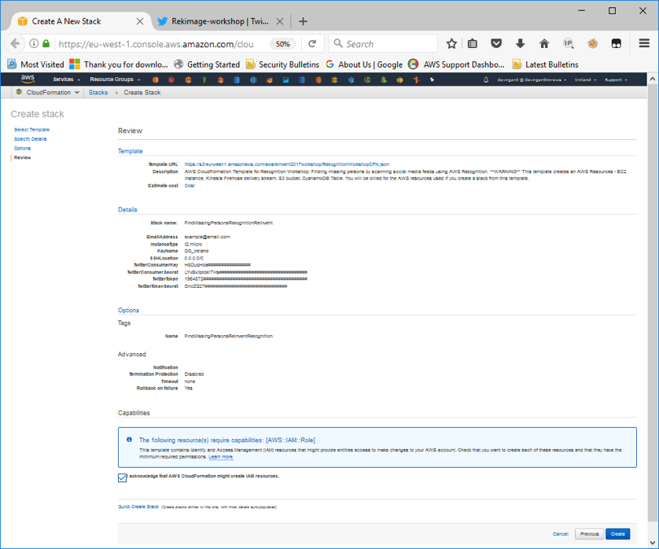

11.  Choose **Create** to deploy the stack.
You can view the status of the stack in the AWS CloudFormation console in the Status column. You should see a status of **CREATE\_COMPLETE** in roughly five (5) minutes.

12.  Note that your email will receive a subscription confirmation from **SNS**. You must confirm subscription in order for the email alerting feature to work in this lab.

Step 3. Validate and Start the Application
==========================================

Once the stack is created, complete the following steps.

1.  Navigate to the **S3** console.

2.  Select the bucket starting with "twtrrekog-rekognition"

3.  Upload your reference missing person image to the base folder in this bucket. Ensure the name matches the reference name used when creating the CloudFormation stack.

4.  Navigate to the stack **Outputs** tab in the CloudFormation console.

5.  Note the name of the EC2 Instance and capture the Public IP address

6.  Open an SSH connection to your instance (if using Windows you will need putty & puttygen to connect)

7.  Run the following command to set the default region in the EC2 instance CLI to Ireland

 **export AWS\_DEFAULT\_REGION=eu-west-1**

8.  Go to /home/ec2-user/rekognition-workshop directory

9.  Run the python source code to start streaming twitter data.

 [ec2-user@ip-172-31-2-51 rekognition-workshop\]\$ **python
 twitter\_streaming.py**

Step 4. Start Twitter Streaming Data
====================================

Now that you have all the infrastructure set up and verified let's start the Twitter feed and run the application to search for missing persons. You can send pictures to the default lab Twitter account by mentioning
**@awsgrant** in your Tweets.

1.  Log into your Twitter account in your mobile phone.

2.  Send pictures! You can experiment in any way you want. Be sure to mention **@awsgrant** in your Tweet.

3.  All images will be logged in DynamoDB, and successful matches will update the DynamoDB record with a match score, and will notify you by email.

4.  You can review CloudWatch logs to see output from the Lambda
    function, as well as perform any debugging.

5.  You can monitor the Kinesis Firehose delivery stream in the Kinesis console.

Step 5. Clean up
=================

1.  Once complete with the workshop you can delete the stack to clean up the environment and stop all services.

2.  You will first have to delete the two S3 buckets created for this lab. Go to the AWS S3 console and view the contents of each bucket, both starting with "twtrrekog". Select each bucket and select **Delete bucket**.

3.  Go to CloudFormation and delete the rekognition-workshop stack by placing a check mark by it and selecting the delete action. This will remove the resources created in the workshop.
